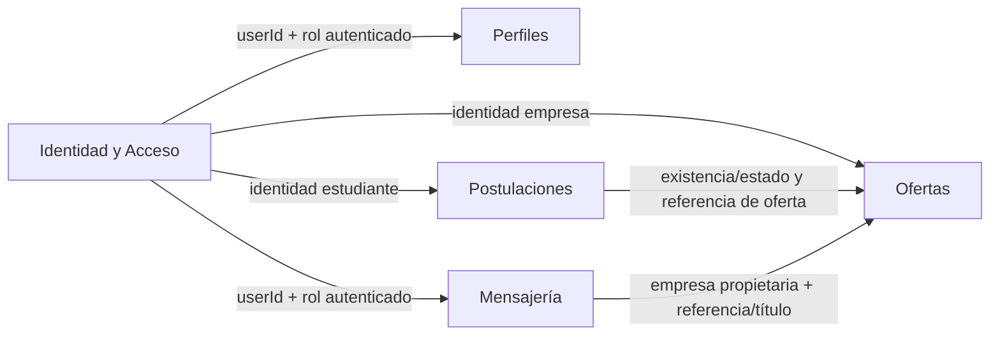

# Context Map S9 — UTrabajo

Este mapa representa **contextos lógicos** dentro del monolito modular actual. Las flechas describen información que cruza fronteras; no implican microservicios.

## Semántica de relaciones

### Identidad y Acceso → Perfiles

- **Proveedor:** Identidad y Acceso.
- **Consumidor:** Perfiles.
- **Fluye:** identificador del usuario autenticado.
- **Motivo:** Perfiles modifica únicamente el perfil del actor autenticado.

### Identidad y Acceso → Ofertas

- **Proveedor:** Identidad y Acceso.
- **Consumidor:** Ofertas.
- **Fluye:** identidad y rol de empresa.
- **Motivo:** crear/actualizar/eliminar ofertas requiere rol company y propiedad.

### Identidad y Acceso → Postulaciones

- **Proveedor:** Identidad y Acceso.
- **Consumidor:** Postulaciones.
- **Fluye:** identidad y rol de estudiante.
- **Motivo:** las postulaciones pertenecen al estudiante autenticado.

### Identidad y Acceso → Mensajería

- **Proveedor:** Identidad y Acceso.
- **Consumidor:** Mensajería.
- **Fluye:** userId y role.
- **Motivo:** requireChatParticipant verifica que el actor pertenezca al chat.

### Postulaciones → Ofertas

- **Proveedor:** Ofertas.
- **Consumidor:** Postulaciones.
- **Fluye hoy:** existencia, active, companyId y title mediante consultas/JOIN sobre job_offer.
- **Motivo:** Postulaciones necesita saber si una oferta acepta una postulación y mostrar su referencia; no es dueña del contenido de la oferta.

### Mensajería → Ofertas — frontera seleccionada

- **Proveedor:** Ofertas.
- **Consumidor:** Mensajería.
- **Fluye hoy:** companyId y title de la oferta.
- **Motivo:** un chat se asocia a una oferta y a su empresa; Mensajería no debe apropiarse del modelo completo de Ofertas.
- **Mecanismo As-Is:** esquema PostgreSQL compartido mediante UTrabajoService/JDBC.
- **Alternativas S9:** contrato síncrono explícito vs proyección mantenida por eventos.
- **Alternativa llevada al Spike 1:** contrato síncrono.

## Regla de lectura

Si una flecha no puede explicarse en términos de proveedor, consumidor, datos, dirección y motivo, no se considera una frontera suficientemente justificada.
