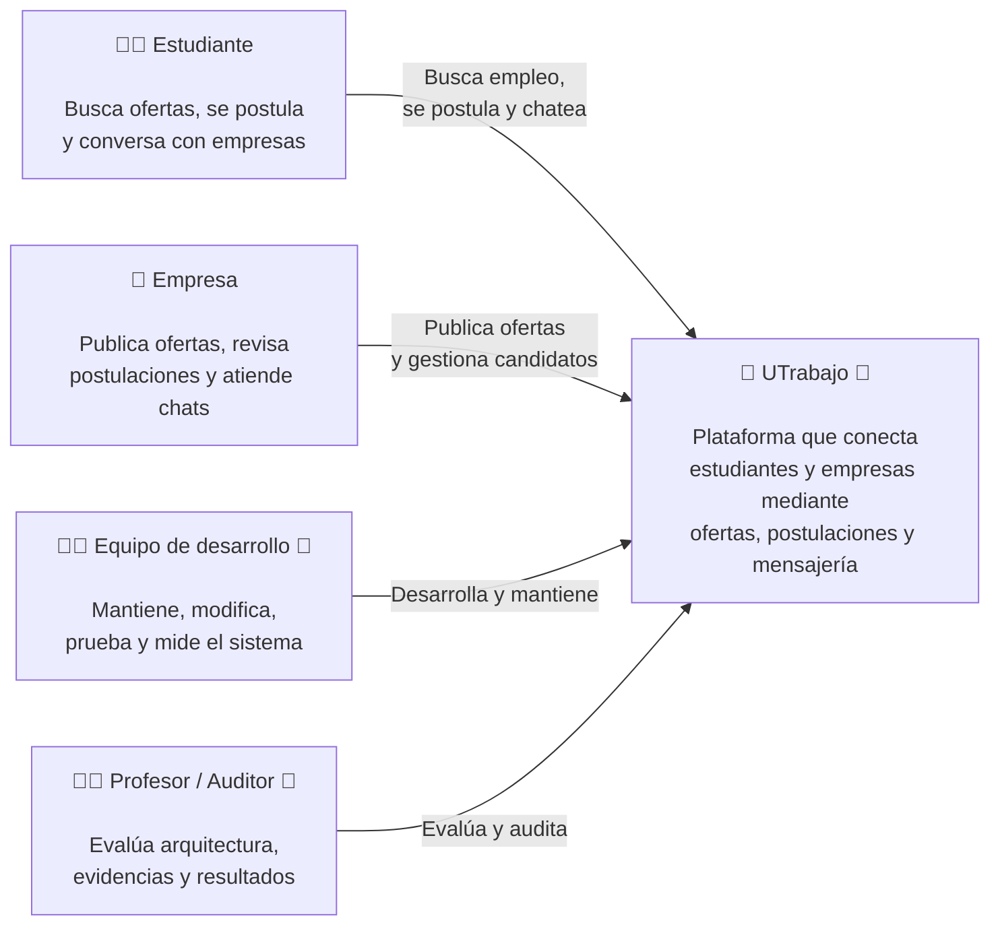

# C1 — Contexto del sistema (as-is)

> Artefacto C4 aprobado por el profesor e importado al dossier para el corte de
> semana 6. La procedencia y las huellas del ZIP se registran en
> `09-c4-trazabilidad-localizacion.md`.

## Propósito y audiencia

Esta vista representa a **UTrabajo como una caja negra**. Su audiencia es el
profesor/auditor y las personas interesadas en el dominio; permite reconocer
quién usa o evalúa el sistema y para qué, sin introducir tecnologías internas.

## Diagrama

## Interpretación

- **Estudiante:** busca oportunidades, se postula y utiliza el chat.
- **Empresa:** publica ofertas, gestiona candidatos y atiende conversaciones.
- **Equipo de desarrollo:** mantiene, prueba y mide el sistema.
- **Profesor/auditor:** evalúa arquitectura, evidencia y resultados.
- **UTrabajo:** se muestra como un único sistema, sin estructura interna.

## Evidencia

- [Descripción de UTrabajo](../README.md)
- [Contexto funcional](01-contexto-sistema.md)
- [Stakeholders y drivers](02-stakeholders-drivers.md)
- [Trazabilidad y correcciones C4](09-c4-trazabilidad-localizacion.md)

## Idea clave para la exposición

> En C1 mostramos UTrabajo como caja negra y nos concentramos en las personas y
> sus objetivos. Las tecnologías y los componentes aparecen en C2 y C3.
