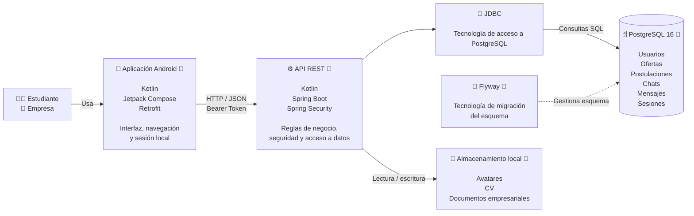

# C2 — Contenedores (as-is)

> Artefacto C4 aprobado por el profesor e importado al dossier para el corte de
> semana 6. La aclaración de qué cajas son contenedores y cuáles son relaciones
> o tecnologías está en `09-c4-trazabilidad-localizacion.md`.

## Propósito y audiencia

Esta vista abre la caja negra y muestra las grandes unidades de ejecución y sus
comunicaciones. Está dirigida al equipo técnico y al auditor para razonar sobre
despliegue, responsabilidades y fronteras de la medición.

## Diagrama



## Contenedores identificados

| Contenedor | Tecnología | Responsabilidad |
| --- | --- | --- |
| Aplicación Android | Kotlin, Compose, Retrofit | Interfaz, navegación, sesión local y consumo de la API |
| API REST | Kotlin, Spring Boot, Spring Security | Seguridad, reglas de negocio y acceso a datos |
| PostgreSQL | PostgreSQL 16 | Persistencia relacional de usuarios, ofertas, postulaciones, chats, mensajes y sesiones |
| Almacenamiento local | Sistema de archivos del backend | Avatares, hojas de vida y documentos empresariales |

JDBC y Flyway aparecen para explicar relaciones técnicas, pero **no son
contenedores desplegables independientes**. JDBC es el mecanismo de acceso y
Flyway administra el esquema al iniciar la API.

## Flujo principal

```text
Estudiante / Empresa
        ↓
Aplicación Android
        ↓ HTTP / JSON + Bearer
API REST
        ↓ JDBC / SQL
PostgreSQL 16
```

## Evidencia

- [Módulo Android](../app)
- [Backend Spring Boot](../backend)
- [Docker Compose](../docker-compose.yml)
- [Configuración del backend](../backend/src/main/resources/application.yml)
- [Migraciones Flyway](../backend/src/main/resources/db/migration)
- [Servicio de archivos](../backend/src/main/kotlin/com/tab/utrabajo/api/service/FileStorageService.kt)
- [Trazabilidad y frontera medida](09-c4-trazabilidad-localizacion.md)

## Idea clave para la exposición

> UTrabajo es cliente-servidor: Android consume una API REST y la API centraliza
> seguridad y negocio antes de consultar PostgreSQL. En S4 se midieron API y
> PostgreSQL en el mismo equipo; Android no fue parte del trayecto medido.
