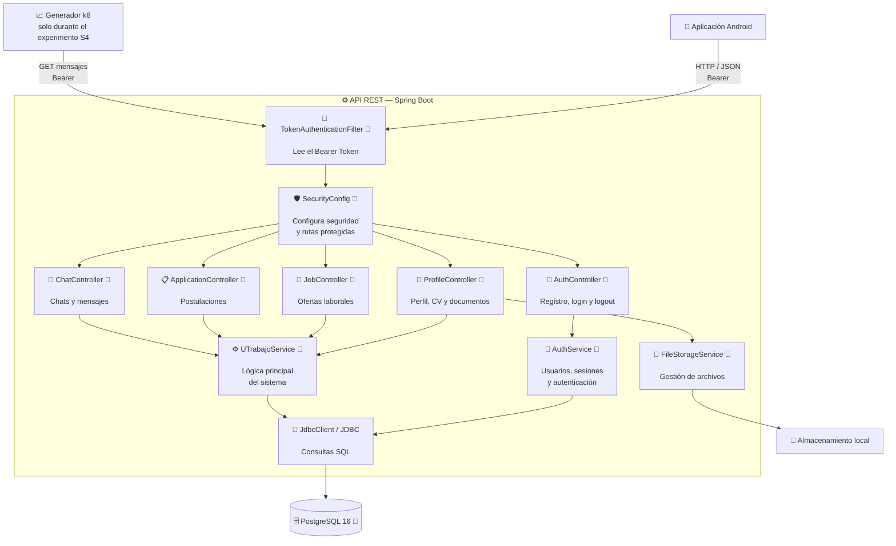

# C3 — Componentes del backend (as-is)

> Vista C3 aprobada por el profesor. Se descompone la API REST porque concentra
> seguridad, reglas del dominio de mensajería y persistencia.

## Propósito y audiencia

La vista muestra responsabilidades internas del backend y permite al equipo de
desarrollo localizar una solicitud desde la seguridad hasta PostgreSQL. También
permite al auditor ubicar el fenómeno medido y contrastar cada caja con código.

## Diagrama



## Componentes principales

- **Controladores:** exponen autenticación, perfiles, ofertas, postulaciones y
  chat por HTTP.
- **Seguridad:** `TokenAuthenticationFilter`, `SecurityConfig` y `AuthService`
  protegen las rutas y las sesiones.
- **Negocio:** `UTrabajoService` concentra las reglas funcionales actuales.
- **Persistencia:** `JdbcClient` ejecuta SQL hacia PostgreSQL.
- **Archivos:** `FileStorageService` valida y guarda archivos locales.

El generador k6 no forma parte del producto: se dibuja con línea de entrada para
localizar el experimento. El flujo efectivo pasa por la cadena de seguridad
antes de llegar al controlador; no se debe interpretar que Android invoca los
controladores saltándose el filtro.

## Trayecto de mensajería medido

```text
k6
 → TokenAuthenticationFilter / SecurityConfig
 → ChatController.messages
 → UTrabajoService.requireChatParticipant
 → UTrabajoService.messages
 → JdbcClient
 → PostgreSQL (message + índice V2)
 → respuesta JSON de 50 mensajes
```

## Evidencia

- [Controladores](../backend/src/main/kotlin/com/tab/utrabajo/api/controller)
- [Filtro de autenticación](../backend/src/main/kotlin/com/tab/utrabajo/api/auth/TokenAuthenticationFilter.kt)
- [Configuración de seguridad](../backend/src/main/kotlin/com/tab/utrabajo/api/config/SecurityConfig.kt)
- [Servicio principal](../backend/src/main/kotlin/com/tab/utrabajo/api/service/UTrabajoService.kt)
- [Migraciones de PostgreSQL](../backend/src/main/resources/db/migration)
- [Localización exacta del experimento](09-c4-trazabilidad-localizacion.md)

## Idea clave para la exposición

> C3 permite seguir una petición real. Los controladores traducen HTTP, el
> servicio valida y ejecuta el caso de uso, y JDBC accede a PostgreSQL. La regla
> de S8 impedirá que un controlador salte el servicio y consulte la base de datos
> directamente.
