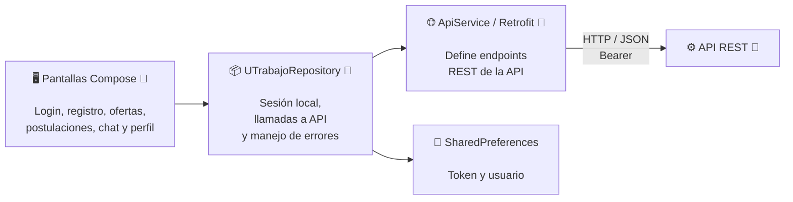

# C3 — Componentes del cliente Android (as-is)

> Vista C3 aprobada por el profesor. Complementa el backend y documenta la
> estructura interna del contenedor Android.

## Propósito y audiencia

Está dirigida a quienes desarrollan el cliente móvil. Explica el recorrido
desde las pantallas hasta la API y deja explícito que Android no se conecta a
PostgreSQL.

## Diagrama

## Componentes principales

- **Pantallas Compose:** interfaz de usuario.
- **UTrabajoRepository:** intermediario entre presentación, sesión y API.
- **ApiService/Retrofit:** contrato HTTP con el backend.
- **SharedPreferences:** almacenamiento local del token y usuario.

## Evidencia

- [Capa de presentación](../app/src/main/java/com/tab/utrabajo/presentation)
- [MainActivity](../app/src/main/java/com/tab/utrabajo/MainActivity.kt)
- [UTrabajoRepository](../app/src/main/java/com/tab/utrabajo/data/UTrabajoRepository.kt)
- [ApiService](../app/src/main/java/com/tab/utrabajo/data/ApiService.kt)
- [Reglas de ofertas](../app/src/main/java/com/tab/utrabajo/domain/JobOfferRules.kt)

## Alcance de la medición

La aplicación Android forma parte de UTrabajo, pero **no participó en la línea
base S4**. k6 sustituyó al cliente y llamó directamente a la API en el mismo
equipo físico que la API y PostgreSQL. Por eso los 9,109 ms no representan
latencia de pantalla, emulador, dispositivo móvil ni red de Internet.

## Idea clave para la exposición

> Las pantallas no acceden a la base de datos. Usan `UTrabajoRepository`, este
> usa Retrofit y toda persistencia compartida pasa por la API REST.
