# Guía integral de exposición con evidencias — semanas 5 a 8

> **Documento principal para la sustentación.** Reúne el relato del equipo, los
> comandos, las capturas reales, los resultados, los enlaces al código y las
> respuestas que deben poder defender los tres integrantes.

- Proyecto: **UTrabajo**.
- Categoría confirmada: **Mensajería y mesa de ayuda**.
- Repositorio: [plantedseeker/Proyectlo_Arquitectura_software](https://github.com/plantedseeker/Proyectlo_Arquitectura_software).
- Corte de las evidencias en vivo: **2026-09-18, America/Bogota**.
- Revisión ejecutada: `b20e86f93ce3c2e3cd4437538f218dc7d3c89ae9`.
- Duración sugerida: **14–16 minutos**, más preguntas.

## 1. Tesis que debe sostener todo el equipo

> UTrabajo conserva mensajería dentro de una API Spring Boot desplegada como
> monolito modular, con Android como cliente y PostgreSQL 16 como persistencia.
> El recorrido vertical funciona de extremo a extremo, la página reciente
> cumple holgadamente el umbral local y el costo del `OFFSET` crece al navegar
> profundamente. Por eso protegimos límites internos y dejamos una migración
> reversible hacia cursor antes de asumir microservicios, broker o caché sin
> evidencia que pague esa complejidad.

Toda afirmación debe conectarse con una de estas cuatro clases de evidencia:

1. **estructura:** C4 y trazabilidad a archivos reales;
2. **funcionamiento:** walking skeleton y checkpoint Android;
3. **medición:** línea base S4 y localización SQL S7;
4. **decisión:** alternativas, ADR-001/002/003 y restricción automática.

## 2. Qué significan los tres ADR

Los ADR no compiten ni se duplican. Responden preguntas distintas y forman una
cadena de decisión:

| ADR | Pregunta | Decisión | Evidencia principal |
| --- | --- | --- | --- |
| [ADR-001](../docs/adr/ADR-001-limites-modulo-mensajeria.md) | ¿Qué estilo y topología convienen ahora? | Mantener mensajería en un **monolito modular** | C4, S4 y costo operativo |
| [ADR-002](../docs/adr/ADR-002-limites-modulos-dependencias.md) | ¿Cómo impedimos que el monolito se degrade? | Dependencias explícitas y `controller !→ JDBC/SQL` | Mapa modular y prueba automática |
| [ADR-003](../docs/adr/ADR-003-paginacion-historial-mensajes.md) | ¿Cómo evoluciona el historial profundo? | Conservar offset reciente y migrar gradualmente a cursor cuando exista necesidad | S4, S7 e índice compuesto |

La forma corta de explicarlo es:

```text
ADR-001: dónde vive mensajería
ADR-002: cómo se separan sus responsabilidades
ADR-003: cómo se consulta y evoluciona su historial
```

## 3. Checklists que responde esta guía

<details>
<summary>Semana 5–6 — C4, trazabilidad, reproducción y defensa</summary>

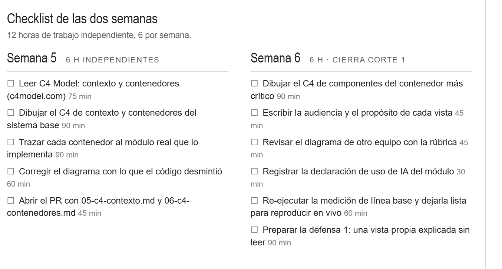

</details>

<details>
<summary>Semana 7–8 — alternativas, ADR y mini-comité</summary>

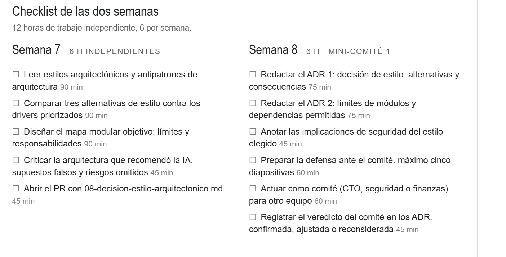

</details>

Las actividades humanas —defensa oral, actuación como comité y veredicto— se
realizan durante la sustentación. Esta guía prueba la preparación y la evidencia
técnica; no inventa que una conversación humana ocurrió antes de realizarse.

### Mapa requisito → evidencia

| Semana | Requisito | Evidencia que se abre |
| --- | --- | --- |
| 5 | C4 contexto y contenedores as-is | [C1](05-c4-contexto.md), [C2](06-c4-contenedores.md) |
| 5 | Trazar contenedores al código | [Matriz C4](09-c4-trazabilidad-localizacion.md) |
| 5 | Corregir lo que el código desmintió | Registro de correcciones en la [trazabilidad](09-c4-trazabilidad-localizacion.md) |
| 6 | C4 componentes del contenedor crítico | [C3 backend](07-c4-componentes-backend.md) y [C3 Android](08-c4-componentes-android.md) |
| 6 | Audiencia y propósito | Sección correspondiente en cada vista C4 |
| 6 | Declaración de uso de IA | [Declaración](11-declaracion-uso-ia.md) |
| 6 | Reproducir línea base | `scripts/run-messaging-baseline.ps1` y evidencias S4 |
| 7 | Comparar tres estilos con drivers | [Decisión S7](08-decision-estilo-arquitectonico.md) y [alternativas](../docs/architecture/alternativas-s7.md) |
| 7 | Mapa modular objetivo | [Módulos y límites](../docs/architecture/modulos-y-limites.md) |
| 7 | Criticar recomendación de IA | [Crítica IA](../docs/architecture/propuesta-ia-critica.md) |
| 8 | ADR 1 y ADR 2 | [ADR-001](../docs/adr/ADR-001-limites-modulo-mensajeria.md) y [ADR-002](../docs/adr/ADR-002-limites-modulos-dependencias.md) |
| 8 | Decisión complementaria de paginación | [ADR-003](../docs/adr/ADR-003-paginacion-historial-mensajes.md) |
| 8 | Implicaciones de seguridad | ADR-001/002, `requireChatParticipant` y prueba negativa |
| 8 | Máximo cinco diapositivas | [Soporte de cinco diapositivas](../docs/architecture/mini-comite-s8-5-diapositivas.md) |

## 4. Orden sugerido de la exposición

| Tiempo | Tema | Resultado que debe quedar claro |
| --- | --- | --- |
| 0:00–4:30 | problema, categoría, C4 y walking skeleton | el sistema real está localizado y conectado |
| 4:30–9:30 | S4, S7, condiciones y fallos | las decisiones se basan en datos con límites declarados |
| 9:30–14:30 | alternativas, ADR, seguridad, IA y CI | se eligió y protegió la opción menos compleja suficiente |
| 14:30–16:00 | demostración o preguntas cruzadas | el equipo comprende el recorrido completo |

El equipo debe aprender también la sección de
[preguntas cruzadas](#14-preguntas-probables-y-respuesta-defendible).

## 5. Problema, categoría, C4 y recorrido vertical

### 5.1 Apertura

**Mostrar:** [contexto del sistema](01-contexto-sistema.md) y [C1 aprobado](05-c4-contexto.md).

**Decir:**

> “UTrabajo conecta estudiantes y empresas mediante ofertas, postulaciones y
> conversaciones. El profesor confirmó la categoría Mensajería y mesa de ayuda.
> La operación observable elegida fue leer los últimos mensajes de una
> conversación extrema y comprobar que un mensaje cruza Android, API y base de
> datos.”

**Argumentar:** tener ofertas no convierte el sistema automáticamente en
catálogo y búsqueda. El experimento trabaja sobre conversaciones, participantes,
mensajes y una distribución extrema de historiales.

### 5.2 Recorrido C4

Abrir en este orden:

1. [C1 — Contexto](05-c4-contexto.md): personas, UTrabajo y sistemas externos.
2. [C2 — Contenedores](06-c4-contenedores.md): Android, API, PostgreSQL y archivos.
3. [C3 — Backend](07-c4-componentes-backend.md): seguridad, controlador, servicio y JDBC.
4. [C3 — Android](08-c4-componentes-android.md): presentación, repositorio y Retrofit.
5. [Trazabilidad](09-c4-trazabilidad-localizacion.md): caja del diagrama → archivo real.

```text
Android presentation
    → UTrabajoRepository / Retrofit
    → HTTP/JSON + Bearer
    → Spring Security
    → ChatController
    → UTrabajoService
    → JdbcClient
    → PostgreSQL 16
```

**No decir:** que JDBC o Flyway son contenedores. Son mecanismos internos de la
API. PostgreSQL sí es un contenedor desplegable.

### 5.3 Walking skeleton

El walking skeleton comprueba la rebanada vertical mínima: autenticar un
estudiante, recorrer una oferta, obtener o crear un chat, insertar un mensaje,
leerlo por API, encontrarlo directamente en PostgreSQL y rechazar acceso sin
token.

Comando:

```powershell
powershell -ExecutionPolicy Bypass -File .\scripts\run-walking-skeleton.ps1 -SkipBuild
```

Salida esperada:

```text
WALKING SKELETON: SOPORTADO
```

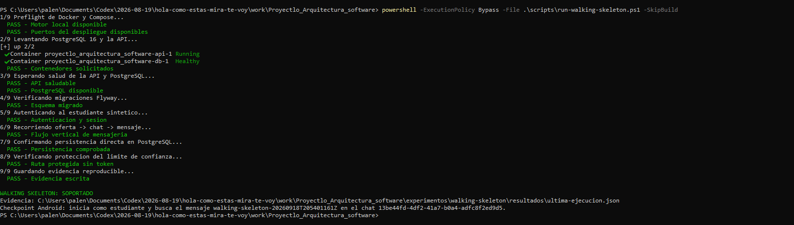

El resultado completo queda en
[`ultima-ejecucion.json`](evidencias-exposicion/datos/2026-09-18-walking-skeleton.json).
La extracción del identificador, chat y marcador se ve aquí:

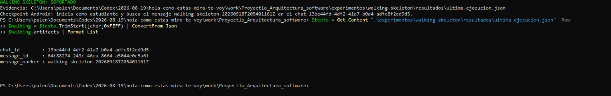

### 5.4 Checkpoint Android

El marcador de la última ejecución fue:

```text
walking-skeleton-20260918T205401161Z
```

El mismo valor aparece en el cliente Android:

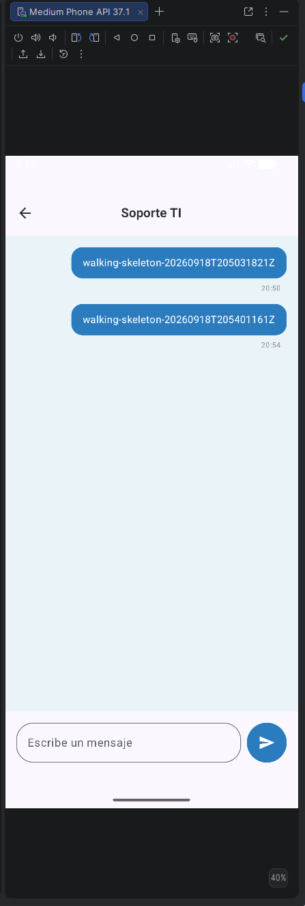

**Cómo defenderlo:** la coincidencia exacta conecta el registro creado por la
API y verificado en PostgreSQL con lo renderizado por Android. El script HTTP no
puede demostrar la pantalla; por eso el checkpoint visual es manual y separado.

**Qué no demuestra:** Internet, alta disponibilidad, entrega en tiempo real ni
rendimiento de la interfaz móvil.

## 6. Escenario S4, línea base y condiciones

### 6.1 Escenario medido

Abrir [atributos de calidad](03-atributos-calidad.md) y
[método/prerregistro](04-escenarios-calidad.md).

La operación es:

```http
GET /api/chats/{chatId}/messages?limit=50&offset=0
```

Condiciones principales:

- 1.000 conversaciones y 289.000 mensajes sintéticos;
- distribución 900×10, 90×1.000, 9×10.000 y 1×100.000;
- 10 usuarios virtuales y 40 solicitudes por corrida;
- cuatro corridas; la primera fue calentamiento definido antes de medir;
- tres corridas válidas y umbral `p95 <= 500 ms`;
- k6, API y PostgreSQL compartieron el mismo equipo físico;
- Android e Internet no participaron en la medición.

### 6.2 Ejecutar S4

```powershell
powershell -ExecutionPolicy Bypass -File .\scripts\run-messaging-baseline.ps1 -SkipBuild
```

La ejecución completa deja evidencia de semilla, contexto, cuatro corridas y
resultado agregado:

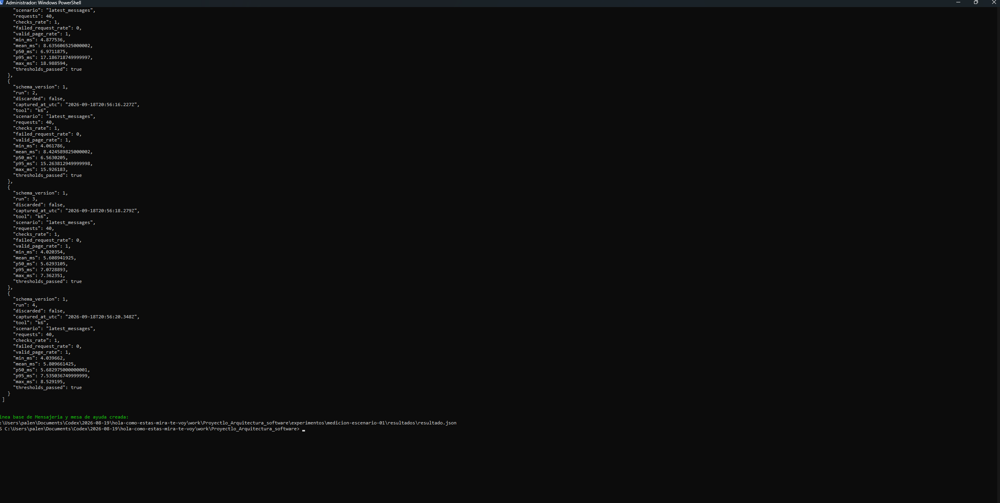

### 6.3 Resultado S4 en vivo

La repetición del 2026-09-18 produjo:

| Campo | Valor observado |
| --- | ---: |
| Corridas válidas | 3 |
| Mediana de p95 | **7,535 ms** |
| Umbral | 500 ms |
| Decisión | `supported` |
| Energía | `plugged_in` |
| Equipo compartido | `True` |
| Commit | `b20e86f93ce3c2e3cd4437538f218dc7d3c89ae9` |

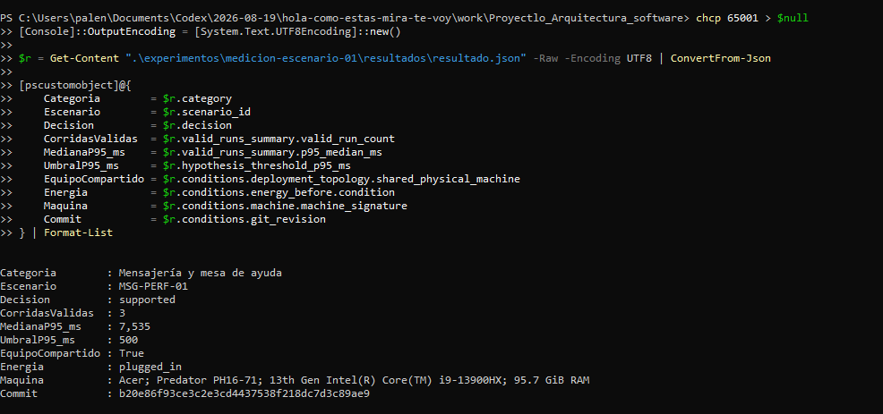

Datos completos: [resultado S4 en vivo](evidencias-exposicion/datos/2026-09-18-linea-base-s4.json).

La evidencia histórica auditada obtuvo p95 de `9,451`, `8,265` y `9,109 ms`,
con mediana `9,109 ms`. La repetición en vivo no reemplaza ese registro: confirma
la misma decisión bajo una nueva ejecución.

**Cómo defenderlo:** la hipótesis queda respaldada solamente para la operación,
carga, máquina y topología declaradas. `7,535 < 500` no prueba producción ni
Internet.

### 6.4 Explicar p95 y mediana

- **p95:** aproximadamente 95 % de las solicitudes terminó en ese tiempo o menos.
- **mediana de p95:** valor central de las tres corridas válidas; reduce la
  influencia de una corrida más alta sin ocultarla.
- **calentamiento:** la primera corrida se descartó por método previo, no porque
  su resultado fuera inconveniente.

## 7. Localización S7 y variación entre planes

S4 mide el tiempo HTTP completo. S7 entra en la frontera
`UTrabajoService/JDBC → PostgreSQL` con `EXPLAIN (ANALYZE, BUFFERS)`.

### 7.1 Ejecutar S7

```powershell
powershell -ExecutionPolicy Bypass -File .\scripts\run-s7-localization.ps1 -SkipBuild -SkipSeed
```

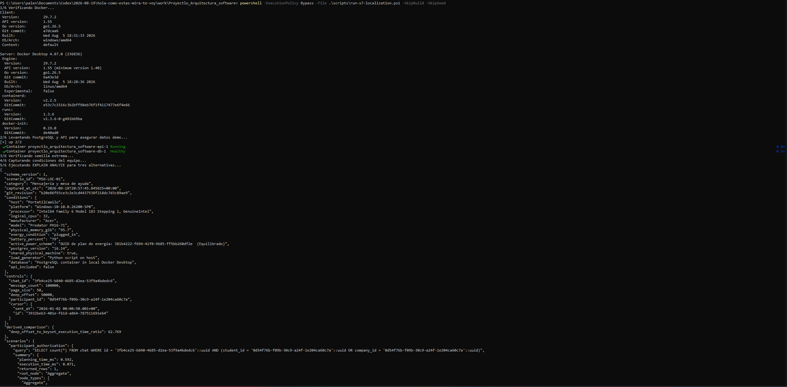

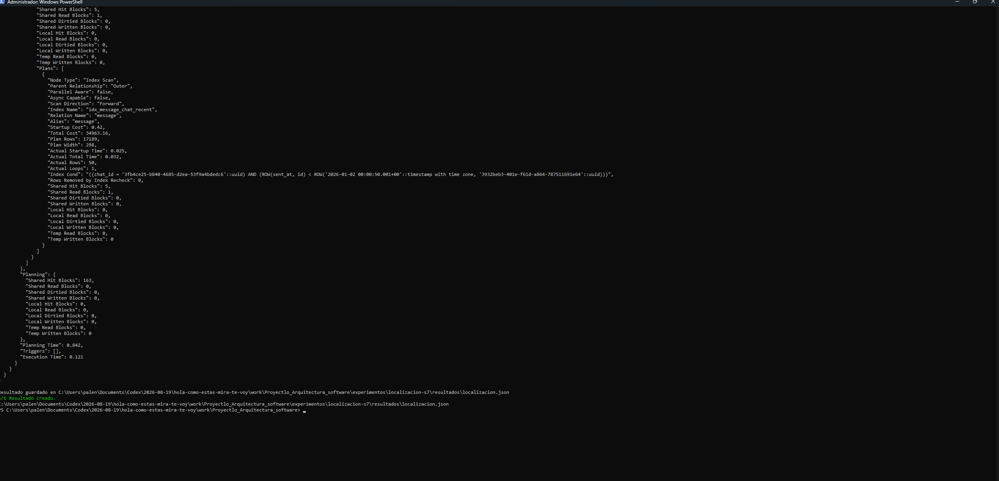

### 7.2 Resultado S7 en vivo

| Escenario | Tiempo observado |
| --- | ---: |
| Autorización del participante | 0,071 ms |
| Página reciente `OFFSET 0` | 0,110 ms |
| Página profunda `OFFSET 50000` | 7,595 ms |
| Cursor equivalente | 0,121 ms |
| Relación offset profundo/cursor | **62,769×** |

El plan profundo de esta repetición utilizó `idx_message_chat_recent` mediante
`Index Scan`; no usó el `Seq Scan` de la captura histórica.

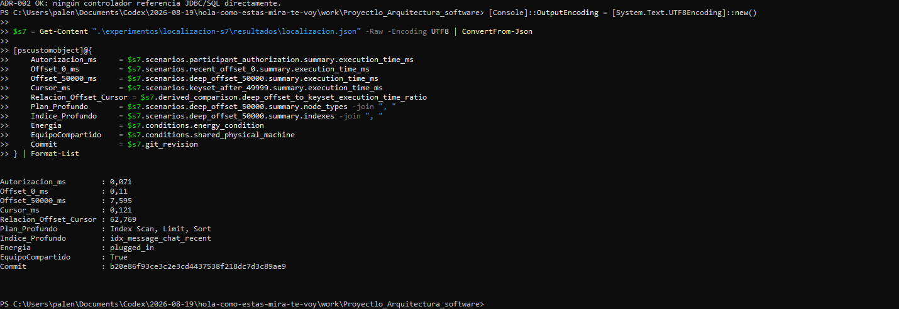

Datos completos: [localización S7 en vivo](evidencias-exposicion/datos/2026-09-18-localizacion-s7.json).

### 7.3 No mezclar la medición histórica con la repetición

| Captura | Reciente | Offset 50000 | Cursor | Relación | Plan profundo |
| --- | ---: | ---: | ---: | ---: | --- |
| Histórica 2026-09-04 | 0,120 ms | 102,050 ms | 0,123 ms | 829,675× | `Seq Scan` + trabajo temporal |
| En vivo 2026-09-18 | 0,110 ms | 7,595 ms | 0,121 ms | 62,769× | `Index Scan` compuesto |

**Interpretación válida:** las cifras exactas cambiaron por estado de caché,
estadísticas y elección de plan, pero ambas capturas muestran el mismo fenómeno:
el offset profundo examina/descarta mucho más trabajo que la página reciente o
el cursor.

**Interpretación inválida:** afirmar que cursor siempre será exactamente 62 o
830 veces más rápido en cualquier máquina.

## 8. Qué puede romperse y cómo recuperarlo

Abrir la [matriz de modos de fallo](../docs/architecture/failure-modes-walking-skeleton.md).

### 8.1 F02 — puertos ocupados

El preflight detectó que otro proyecto publicaba `5432` y `8080`. Se negó a
detener o borrar contenedores automáticamente:

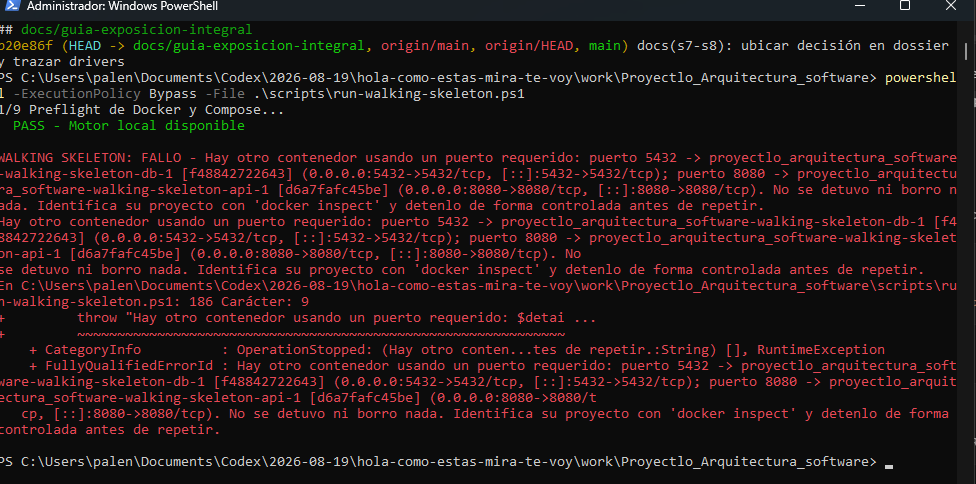

**Control:** identificar exactamente al propietario, detener solo el proyecto
correcto y conservar los volúmenes.

**No hacer:** `docker compose down -v` como solución general. `-v` elimina los
volúmenes y no es una estrategia de recuperación de datos.

### 8.2 API temporalmente detenida

```powershell
docker compose stop api

try {
    Invoke-RestMethod http://localhost:8080/actuator/health -TimeoutSec 5
}
catch {
    Write-Host "FALLO CONTROLADO DETECTADO: API no disponible" -ForegroundColor Yellow
}

docker compose start api
```

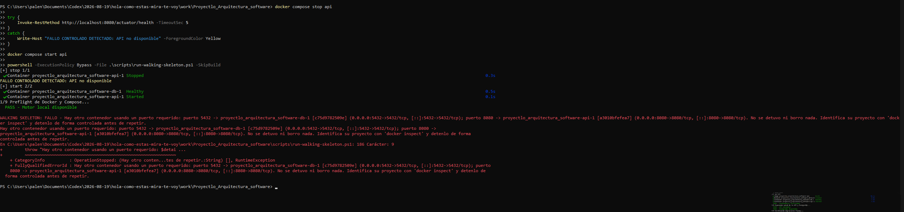

Después se repitió el walking skeleton y terminó nuevamente en `SOPORTADO`, sin
borrar el volumen.

### 8.3 Defecto encontrado y corregido en el instrumento

Durante la repetición, el preflight confundió contenedores propios con ajenos:

- `docker compose ps -q` entregaba IDs completos;
- `docker ps` entregaba IDs abreviados;
- la comparación nunca coincidía.

La corrección usa `docker ps --no-trunc`, por lo que ambos lados comparan IDs
completos. Este caso demuestra diagnóstico del instrumento, no un fallo del
backend. Ver [script corregido](../scripts/run-walking-skeleton.ps1).

## 9. Alternativas contra drivers

Abrir [drivers priorizados](02-stakeholders-drivers.md),
[decisión consolidada](08-decision-estilo-arquitectonico.md) y
[comparación completa](../docs/architecture/alternativas-s7.md).

| Alternativa | Beneficio | Costo/riesgo | Decisión |
| --- | --- | --- | --- |
| Monolito sin límites ejecutables | mínimo esfuerzo inicial | acoplamiento y seguridad dispersa | descartada |
| Monolito modular + regla | bajo costo, límite verificable, misma operación | mantener prueba y documentación | **seleccionada** |
| Microservicio + broker | escalado/despliegue independiente | red, secretos, consistencia, observabilidad y operación | diferida |

Drivers usados para comparar:

1. rendimiento en conversaciones extremas;
2. confidencialidad y autorización por participante;
3. integridad y orden estable de mensajes;
4. modificabilidad del cliente/contrato;
5. reproducibilidad y costo operativo.

**Conclusión:** S4 no muestra presión para distribución y S7 localiza un problema
de navegación profunda que puede resolverse dentro de PostgreSQL y el contrato.

## 10. Mapa modular y seguridad

Abrir [mapa modular](../docs/architecture/modulos-y-limites.md).

```text
Android presentation
    ↓
Android data / Retrofit
    ↓ HTTP + Bearer
Backend controller
    ↓
Backend service / auth
    ↓
JDBC / Flyway
    ↓
PostgreSQL 16
```

Reglas defendibles:

- Android no conoce credenciales de PostgreSQL.
- Los controladores atienden HTTP y delegan.
- Los controladores no acceden directamente a JDBC/SQL.
- `UTrabajoService.messages` verifica `requireChatParticipant` antes de leer.
- `sendMessage` verifica participación y ejecuta `INSERT message` + `UPDATE chat`
  dentro de una transacción.
- La consulta usa orden estable `(sent_at, id)` e índice compuesto.

Código que debe poder abrirse:

- [`ChatController.kt`](../backend/src/main/kotlin/com/tab/utrabajo/api/controller/ChatController.kt)
- [`UTrabajoService.kt`](../backend/src/main/kotlin/com/tab/utrabajo/api/service/UTrabajoService.kt)
- [`V2__message_recent_index.sql`](../backend/src/main/resources/db/migration/V2__message_recent_index.sql)
- [prueba de integración](../backend/src/test/kotlin/com/tab/utrabajo/api/UTrabajoApiApplicationTests.kt)

## 11. Restricción ejecutable y CI

Comando local:

```powershell
python .\scripts\check_architecture.py
```

Salida esperada:

```text
ADR-002 OK: ningún controlador referencia JDBC/SQL directamente.
```

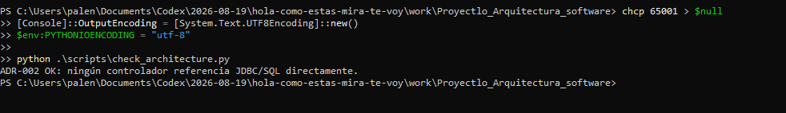

La regla es intencionalmente mínima. No reemplaza pruebas funcionales ni detecta
toda forma de acoplamiento; protege una frontera concreta de ADR-002.

[](https://github.com/plantedseeker/Proyectlo_Arquitectura_software/actions/workflows/ci.yml)

El workflow [`.github/workflows/ci.yml`](../.github/workflows/ci.yml) ejecuta:

- restricción de ADR-002;
- pruebas de integración contra PostgreSQL 16;
- validación de instrumentos S4/S7;
- pruebas, lint y APK Android.

## 12. Crítica de la propuesta de IA

Abrir [propuesta IA criticada](../docs/architecture/propuesta-ia-critica.md).

| Sugerencia | Veredicto | Razón |
| --- | --- | --- |
| Identificar mensajería como frontera | aceptada | coincide con categoría y C3 |
| Mantener límite de página e índice | aceptada | existe y respalda página reciente |
| Comparar cursor y offset profundo | aceptada como experimento | produce evidencia causal S7 |
| Migrar Android inmediatamente | modificada | primero compatibilidad y necesidad real |
| Microservicio de chat | rechazada por ahora | no hay presión medida que pague su costo |
| Redis | rechazada | no existe patrón medido ni invalidación definida |
| Broker | rechazado por ahora | la operación observada es lectura |
| WebSocket | fuera del alcance | resuelve entrega en tiempo real, no historial |
| Kubernetes | rechazado | contradice el alcance local y no responde a evidencia |

**Frase clave:** “La IA propuso opciones; el equipo separó decisiones, comprobó
supuestos y aceptó, modificó o rechazó cada recomendación con evidencia.”

## 13. Guion de demostración en vivo

### Antes de iniciar

```powershell
git status --short --branch
docker version
docker compose version
docker compose ps
```

La rama usada para preparar la guía quedó registrada en esta captura:

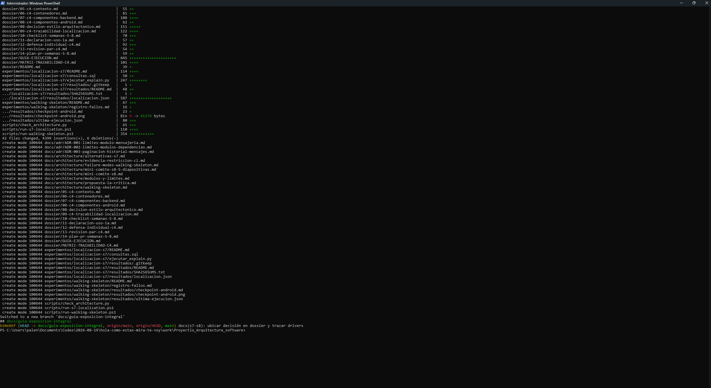

### Demostración recomendada de 90 segundos

1. Ejecutar el walking skeleton con `-SkipBuild`.
2. Señalar los nueve pasos `PASS` y `SOPORTADO`.
3. Extraer `message_marker` del JSON.
4. Mostrar el mismo marcador en Android.
5. Ejecutar `python .\scripts\check_architecture.py`.
6. Abrir el badge de CI y un ADR.

No conviene ejecutar S4 y S7 completas dentro de una exposición corta. Mostrar
sus capturas y JSON versionados; reproducirlas solo si el profesor lo solicita.

### Comandos de respaldo

```powershell
# Walking skeleton
powershell -ExecutionPolicy Bypass -File .\scripts\run-walking-skeleton.ps1 -SkipBuild

# Línea base S4
powershell -ExecutionPolicy Bypass -File .\scripts\run-messaging-baseline.ps1 -SkipBuild

# Localización S7, reutilizando semilla
powershell -ExecutionPolicy Bypass -File .\scripts\run-s7-localization.ps1 -SkipBuild -SkipSeed

# Restricción de arquitectura
python .\scripts\check_architecture.py
```

## 14. Preguntas probables y respuesta defendible

| Pregunta | Respuesta corta |
| --- | --- |
| ¿Por qué mensajería y no catálogo? | Se mide una operación de chat y una distribución extrema de conversaciones, no búsqueda textual |
| ¿Por qué PostgreSQL y no Firebase? | El alcance exige PostgreSQL 16; aporta integridad relacional, restricciones, índices y migraciones versionadas |
| ¿Por qué Android no accede a la DB? | Evita exponer credenciales y centraliza autorización/reglas en la API |
| ¿Qué diferencia C1, C2 y C3? | C1 muestra personas/sistema; C2 despliegues; C3 componentes internos del contenedor crítico |
| ¿Qué prueba el walking skeleton? | Conectividad, migración, autenticación, flujo principal, persistencia y ruta protegida |
| ¿Qué no prueba? | Internet, alta disponibilidad, tiempo real ni rendimiento de pantalla |
| ¿Qué es p95? | Tiempo bajo el cual terminó aproximadamente 95 % de las solicitudes |
| ¿Por qué descartar la primera corrida? | Fue calentamiento prerregistrado, no selección posterior de resultados |
| ¿Por qué usar mediana? | Resume el centro de tres p95 válidos con menor sensibilidad a una corrida alta |
| ¿Qué compartió equipo físico? | Generador k6, API y PostgreSQL mediante Docker Desktop |
| ¿Por qué cambió S7 de 829× a 63×? | Cambió el plan/caché; ambas capturas conservan el fenómeno de mayor trabajo del offset profundo |
| ¿Cursor ya está implementado en Android? | No; ADR-003 propone migración compatible cuando exista navegación profunda real |
| ¿Por qué no afirmar 63× en producción? | Es una observación local de un plan, no una distribución productiva |
| ¿Por qué no microservicios? | No existe presión medida que compense red, secretos, consistencia y operación distribuida |
| ¿Qué protege ADR-002? | La dirección de dependencias; en particular impide JDBC/SQL directo en controladores |
| ¿Para qué sirve ADR-003? | Separa la decisión de paginación y define una ruta reversible hacia cursor |
| ¿Cómo evitan leer chats ajenos? | Bearer y `requireChatParticipant` antes de consultar/escribir |
| ¿La regla CI prueba toda la arquitectura? | No; protege una frontera concreta y se complementa con pruebas y revisión |
| ¿Qué aceptaron de la IA? | Frontera de mensajería, límite/índice y experimento cursor-offset |
| ¿Qué haría reabrir los ADR? | SLA incumplido, navegación profunda real, tiempo real, escalado independiente o equipos separados |

## 15. Evidencia de contribución y revisión

- [PR #6 — localización S7](https://github.com/plantedseeker/Proyectlo_Arquitectura_software/pull/6)
- [PR #10 — ADR y CI](https://github.com/plantedseeker/Proyectlo_Arquitectura_software/pull/10)
- [PR #11 — alineación S7–S8](https://github.com/plantedseeker/Proyectlo_Arquitectura_software/pull/11)
- [PR #12 — ubicación canónica y trazado de drivers](https://github.com/plantedseeker/Proyectlo_Arquitectura_software/pull/12)
- [Historial de Actions](https://github.com/plantedseeker/Proyectlo_Arquitectura_software/actions/workflows/ci.yml)

## Cierre conjunto

> “No elegimos más tecnología por anticipado. Primero comprobamos el recorrido
> real, medimos la página reciente, localizamos el costo de navegación profunda,
> comparamos alternativas contra drivers y protegimos una frontera mediante CI.
> La solución actual es un monolito modular con PostgreSQL 16 y una evolución
> reversible hacia cursor cuando el producto la necesite.”

## Lista final de verificación

- [ ] Los tres conocen la tesis central.
- [ ] El equipo puede recorrer C1 → C2 → C3 → código.
- [ ] El equipo diferencia S4 HTTP de S7 SQL.
- [ ] El equipo diferencia resultado histórico de repetición en vivo.
- [ ] El equipo explica ADR-001, ADR-002 y ADR-003 sin mezclarlos.
- [ ] Los tres pueden explicar por qué no microservicios/Redis/broker ahora.
- [ ] Docker Desktop está abierto y los puertos están controlados.
- [ ] Android muestra el mismo marcador del último JSON.
- [ ] El badge de CI está visible.
- [ ] No se ejecutará `docker compose down -v`.
- [ ] Cada integrante puede responder una pregunta de otra sección.
